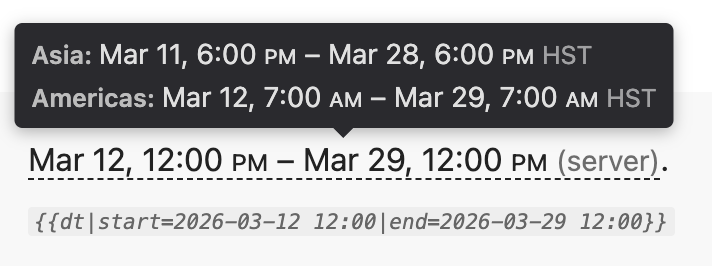

# Inline Datetime Gadget

This is a Mediawiki gadget for game wikis with a few game servers in different timezones, where a server's timezone impacts when game content releases.

This gadget will format times and timespans as inline text with a tooltip (accessible on hover or tap) that translates the time to the user's local time. The information is kept minimal for compactness but expansion occurs as needed for precision.

[Demo page](https://solidkalium.github.io/inline-datetime/)

Example tooltip:



## Features
[Full specifications](specifications.md) | [Development notes](DEVELOPMENT.md)

**Supported:**
* Multiple servers with distinct timezones
  * Server names and timezones are configured in `MediaWiki:Gadget-inline-datetime-config.js`
* Two kinds of datetimes:
  * Single moment across servers (e.g. `04:00 +8`): usually server maintenance
    * Inline text: user's timezone
    * Tooltip: servers' timezones
  * Same server time across servers (e.g. `04:00 server`): usually daily & weekly resets
    * Inline text: the server-relative time
    * Tooltip: when each server observes that time, according to the user's timezone
* Single times or timespans (can mix and match date kinds)
* Specifying a single server for the tooltip instead of showing all of them
* Specifying alternate text to display inline.
  * This could be used to provide a tooltip on patch notes where you want the displayed text to match the official description of the time.
* Basic default text to display when Javascript is disabled
* Basic semantic HTML classes to enable custom css
* Auto-deduplicating things like the year or day when it is the same for the whole timespan in the user's timezone.
* Provides [[Category:Pages with InlineDateTime errors]]

**Known issues:**
* The no-JS fallback text is not styled and doesn't deduplicate as well as the JS code.

**Not supported:**
* Languages other than English
* Time formatting other than American
* Events that occur at unrelated times on different servers
  * But: you can use the single server capability to list them separately inline with multiple template invocations.
* Live changes to the user's timezone after page load
* User settings: keeping it simple and avoiding confusion
  * Can't display a specific server's info inline
  * Can't hide a server's info in the tooltip
    * The tooltip may be unwieldy if displaying a large number of servers
* A server that changes timezone (either due to daylight savings time or permanently on some date)
* Force year to be displayed, even for the current year
  * But: you can use a raw text override
* Disable tooltip (other than by disabling js)
* Support for showing seconds. We assume everything is minute-aligned.
* Tooling for locating date-like entries on pages that haven't been wrapped in the template.
* PHP time parsing `{{time:}}`
  * This is intentional to prevent silent errors. If someone writes something like "from maintenance until Mar 29 reset" would likely be collapsed to March 29 of either the current or next year. If there's a good reason to support "second tuesday of last month + 10 seconds" then this could change.
  * Did you know that "last month's second tuesday" is *false* but "second tuesday of last month" is an actual time? Why are "+2 hours", "+2 hrs", and "+2 hourss" all different? So PHP can behave in ways that aren't always obvious.
  * By default PHP will be using the wiki server's timezone, which isn't desirable when the gadget needs to be told that a time doesn't have a specific timezone.
  * There's probably a way to make this work well enough in most cases, but it hasn't been a focus.
  * This would require the ParserFunctions extension, but it's already on most wiki installs, so this wouldn't be a large requirement.


## Install and Configure
There are two ways to get the files onto a wiki:
* Manual copy:
  * Copy the JS and CSS gadget files into `MediaWiki:`
  * Copy the Lua module into `Module:`
  * Copy the template into `Template:`
  * Optional: copy `Template:IDT` as a short alias that forwards to `Template:InlineDateTime`
* XML import:
  * Download the [XML export file](https://solidkalium.github.io/inline-datetime/mediawiki-export.xml)
    * To build this locally, see [DEVELOPMENT.md](DEVELOPMENT.md#MediaWiki-import-workflow)
  * Import that XML file into the target wiki
  * Update `MediaWiki:Gadgets-definition` or your wiki's gadget config to load the gadget JS and CSS pages

This repository's export file includes:
* `MediaWiki:Gadget-inline-datetime-config.js`
* `MediaWiki:Gadget-inline-datetime.js`
* `MediaWiki:Gadget-inline-datetime.css`
* `Module:InlineDateTime`
* `Template:InlineDateTime`
* `Template:InlineDateTime/doc`

`MediaWiki:Gadgets-definition` is not included in the export because it is site-specific.
[`Template:IDT`](gadget/Template_IDT.wikitext) is also not included; add it manually only if you want the shorter alias.

### Gadgets-definition

After importing the pages, add an entry to `MediaWiki:Gadgets-definition`. A typical entry looks like:

```mediawiki
* inline-datetime[ResourceLoader|default|type=general]|Gadget-inline-datetime-config.js|Gadget-inline-datetime.js|Gadget-inline-datetime.css
```

Option notes:
* `ResourceLoader` — registers the gadget as a ResourceLoader module for better performance and dependency support; remove this option if your wiki does not use ResourceLoader
* `default` — enables the gadget for all users automatically; replace with `hidden` if you want it available but opt-in only
* `type=general` — runs scripts in the page scope; required for this gadget to access the page DOM
* The config file **must be listed before** the main JS file so it is executed first

### Server configuration

Edit `MediaWiki:Gadget-inline-datetime-config.js` after importing to set your wiki's servers. Each entry needs:
* `key` — internal identifier used in the `|server=` template parameter
* `label` — display name shown in tooltips
* `offsetMin` — fixed UTC offset in minutes (e.g. UTC+8 = `480`, UTC-5 = `-300`)

The gadget has no DST support; use fixed offsets only. The default config ships with Asia (UTC+8) and Americas (UTC-5).

### Styling
The gadget emits semantic classes so it can inherit surrounding text styling while still allowing some customization.

Useful classes:
* `.dt-inline`: the inline wrapper element
* `.dt-tooltip`: the tooltip container
* `.dt-tooltip-row`: a single server row in the tooltip
* `.dt-tz` and `.dt-tt-tz`: timezone labels inline and in the tooltip
* `.dt-ampm` and `.dt-tt-ampm`: AM/PM styling inline and in the tooltip

Useful CSS variables:
* `--dt-tooltip-bg`: tooltip background color
* `--dt-tooltip-fg`: tooltip foreground color

For error CSS, see [#error-handling in the specifications](specifications.md#error-handling).


## Q & A
* What alternatives were considered?
  * [**TZclock** gadget](https://dev.fandom.com/wiki/TZclock): This displays the current time in a specified timezone. It can't display a specific moment in time in the user's timezone. It uses its own implementation of calculating timezones instead of using built in capabilities in Lua or Javascript.
  * [**clock**](https://endfield.wiki.gg/wiki/MediaWiki:Gadgets/clock/main.css) and [**clockScripts**](https://endfield.wiki.gg/wiki/MediaWiki:Gadgets/clockScripts/main.js) gadgets: This shows the current server times and countdowns until resets. It doesn't support inline display or showing specific times or timespans.
  * [**countdown** script](https://dev.fandom.com/wiki/Countdown): This inserts a live countdown into a line of text. When the time is in the past, a different message is shown.
    * Note: For events with a known timespan (e.g. Jan 6-7) starting in the future (e.g. today is Jan 1), it isn't possible to set a single countdown. Instead, the countdown must be set to start counting down until the start, after which it will automatically show a static message like "event is live!". Then if you want to show a countdown until the event ends, you need to edit in a replacement countdown.
  * [**TimezoneConverter** extension](https://www.mediawiki.org/wiki/Extension:TimezoneConverter): not currently approved on wiki.gg, and only shows one time in the user's timezone. But it does accept any time format PHP can make sense of.
* Is this vibe coded slop?
  * Sure: it isn't hand crafted. But there is a specification document and a visual test suite.
* Why doesn't it do X?
  * Features not needed for the initial use case were avoided to reduce unneeded complexity. The initial server already didn't have language or time format localization, so those weren't considered necessary.
  * The gadget is designed to be flexible yet have minimal input surface area. That means as little magic parsing as possible and keeping outputs minimal and predictable.
* Can I contribute?
  * Yes! This is an open source project that you can fork and use as you wish. Currently, this project has only one contributor and once it meets the needs of the intended wiki, it might or might not be maintained. If you have a simple bug fix, I will be happy to test and accept it. If you want to take over as maintainer and have added some features, I'd be happy to add a link from my repository to yours.
  * Any contributions submitted for inclusion in this project are assumed to be under the same license as the project, unless stated otherwise.
