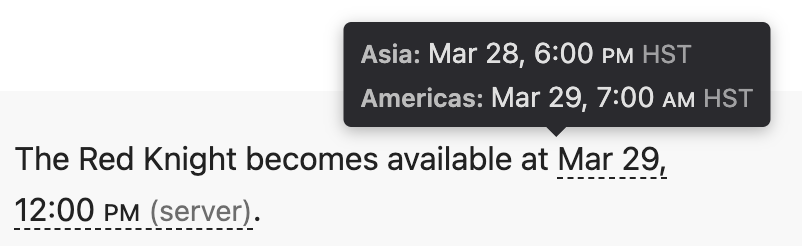
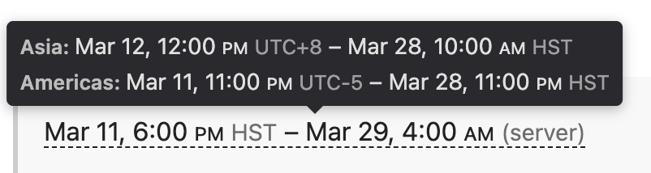

# Specifications

For features included and not included, see the main [README.md](README.md#features)

## Parameters
Format: `{{dt|start=YYYY-MM-DD HH:MM|end=YYYY-MM-DD HH:MM OFFSET}}`

All parameters are optional except `start`/`1`.

* `start`/`1` and `end`/`2`: start and end times
  * Kinds of time (input)
    * Absolute time: a single moment affecting all servers simultaneously
      * A UTC offset like "+8" or "-5" is specified at the end of the string
    * Server time: each server is affected when this is the server's local time
      * No offset is specified *or* the offset is "server"
* `server`: the tooltip will only list the specified server. Omit for all servers to be shown.
* `raw`: text to show inline instead of the auto-formatted date time. JS will still build a tooltip from the start/end values.

## Output

There are two main parts of the display: the inline text and the tooltip.

Example tooltips:

| Single time | Timespan | Mixed / different timezones |
| --- | --- | --- |
|  |  |  |

### Time formatting

Time and timespan formatting is the same whether inline or in the tooltip.

* Kinds of time (output)
  * Visitor's time: displayed in the browser's timezone (e.g. "EDT")
  * Specific server time: displayed in the server's timezone (e.g. "UTC+8")
  * Generic server time: displayed with a timezone of "(server)"
* Timezone deduplication
  * When start and end are shown in the same timezone, it's only labelled at the end
  * When they differ, each endpoint has a timezone label
    * This could be one absolute time and one server time
    * Or the visitor's timezone changes abbreviations (such as due to DST)
* Current year hiding
  * When the time (or full timespan) is in the same year (in the timezone it is displayed), then the year is hidden to save space.
* Date format examples:
  * `start` only: "Mar 29, 12:00 PM (server)" or "Mar 11, 6:00 PM EDT"
  * `start` and `end` share a timezone and date: "Mar 11, 6:00 PM – 12:00 AM EDT"
  * `start` and `end` share a timezone but not date: "Mar 11, 6:00 PM – Mar 12, 12:00 AM EDT"

### Inline display behavior
* The text is a time (or timespan) description that applies to all servers.
  * Absolute time: the visitor's local time
  * Server time: the generic server time
* Inherits styling applied around it (e.g. bold or italics)
  * If Javascript is enabled, affordances like a dashed underline are displayed to indicate there is a tooltip available.
* If `raw` is specified, it is the inline text. `start` and `end` will only affect the tooltip. The description relevant to all servers isn't displayed at all; it isn't moved into the tooltip.
* If Javascript is disabled, the fallback value is shown. This is a non-localized description that applies to all servers. It uses the timezone given to the template. The fallback text currently isn't styled.

### Tooltip behavior
* Each server gets its own line showing the time (or timespan) in a server-specific manner.
  * Absolute time: the server's time when it is affected
  * Server time: the visitor's local time when the server is affected
* If `server` was specified, then only that server is shown in the tooltip.
* If Javascript is disabled, the tooltip isn't available.

### Testing
* To make testing easier, a fake browser timezone can be set.
  * Note: Intl provides short timezone descriptions like "GMT+1" instead of "BST" when the timezone isn't common in the browser's locale (e.g. "en-US" instead of "en-GB"). This is to prevent confusion from multiple timezones using the same abbreviation.

## Accessibility

### Semantics
* The inline element is given `role="button"` when a tooltip is available, indicating it is interactive.
* `aria-expanded` reflects whether the tooltip is explicitly open (`"true"`) or closed (`"false"`).
* `tabindex="0"` ensures the element is reachable by keyboard even if the host element is not natively focusable.

### Keyboard interaction
* **Tab / Shift+Tab**: moves focus to and from the element.
* **Enter or Space**: toggles the tooltip open or closed (matching standard button behavior).
* **Escape**: closes an open tooltip and stops event propagation so the key does not bubble to page-level handlers.

### Pointer interaction
* A single click toggles the tooltip open or closed. Note: clicking to close while the cursor is still over the element looks like a no-op because hover immediately re-shows the tooltip; the `dt-open` state is still cleared correctly. To disable hover-triggered display, override with `.dt-inline.dt-has-tooltip:hover .dt-tooltip { display: none; }` in a local stylesheet.
* Clicking outside an open tooltip closes it.
* `cursor: pointer` provides a visual affordance that the element is interactive.
* Hovering shows the tooltip passively without requiring a click.

### What is not in scope
* The tooltip content is informational only and has no interactive elements, so focus does not move into it.
* No live region announcements are made when the tooltip opens; `aria-expanded` on the trigger communicates state to assistive technology.
* If Javascript is disabled, the tooltip is unavailable entirely; there is no accessible fallback for the tooltip content.

## Architecture
* Lua module (Module:InlineDateTime)
  * parses input
  * generates fallback text
  * emits structured HTML with data attributes
* Template (Template:InlineDateTime)
  * thin #invoke wrapper
* JS gadget
  * display logic
  * user timezone detection
  * tooltip construction
  * Runs on DOMContentLoaded and on mw.hook('wikipage.content') for dynamic content
* CSS gadget
  * styling for inline, tooltip, and touch
  * Uses CSS custom properties --dt-tooltip-bg and --dt-tooltip-fg for theme compatibility
* Does not rely on other gadgets or extensions

## Design Requirements
* Keep inputs simple
  * Complex inputs will prevent the gadget from being used
  * Inputs should be flexible enough to not require inhuman consistency, but should still be limited enough that there aren't weird edge cases.
* Focus on a core use case: a tooltip for times and timespans that translates timezones
  * Let other templates wrap the script if they need other features like:
    * Insert the date in a template with text, possibly with a countdown added dynamically
    * Parse a raw unformatted changelog date description and automatically create the tooltip
  * We only support single-moment and server's-time-zone times. If something happens at unrelated times on different servers, it shouldn't be hidden in a tooltip unless it is called out in a clear way.
* Keep output text simple
  * Long descriptions are harder to make sense of, especially for timespans
  * This doesn't necessarily mean a simple transformation to make the output text
  * We can move certain time elements to the end if they are the same for the start and end. E.g. only list the timezone once at the end if both times have the same timezone.
  * If we don't hide part of the time (e.g. the year) for the start time, it shouldn't be hidden for the end time.
* Keep output style easy to read
  * The text should be easy to scan quickly
  * Things like timezone are valuable and must be part of the output, but they aren't the core info being communicated, so they should have lower emphasis.
  * Times should have the same styling whether inline or in the tooltip.
  * Styles should work in both light and dark modes.
  * Use nowrap to keep the full start and full end times each on a single line. Hopefully they are both on the same line, but they may need to be split on narrow displays.
    * Long lines are accepted since we're already keeping content tight.
* Must look ok when Javascript is disabled

## Error handling

### Error states
* **Hard error** (`dt-error dt-error-hard`): `start` is absent or blank. There is no safe fallback text, so the span displays "[no start time specified]" in red by default. `raw` is not shown — it is meaningless without a start time to generate a tooltip from.
* **Soft error** (`dt-error dt-error-soft`): `start` or `end` is present but cannot be parsed. No half-valid state is supported — if either is invalid the pair is treated as fully invalid. The span displays the intended text: `raw` if provided, otherwise the original input strings. No default color is applied since the text itself is visible to visitors.

### Styling
* `dt-error-hard` and `dt-error-soft` can be targeted individually or together via a shared selector.
* Neither class has structural styles that need to be preserved; wikis can freely override both.
* During MediaWiki edit preview (`#wikiPreview`), both classes receive a dashed red outline so editors notice errors before saving.
* Additional visible indicators (e.g. icon via `::before`) can be added in a local stylesheet without changing the markup.

### Error tracking
* All error spans append `[[Category:Pages with InlineDateTime errors]]` to the page output.
* The category does not need to be manually created to function — pages are tracked automatically. The category page can be created later to add a description.
* `[[Category:...]]` emits no visible inline content; it only adds the page to the category list shown at the bottom of the page.

## Considerations

### Style considerations
* Decided each server should be a single line of "start-end" instead of having separate sections for start and end.
* Decided to leave AM/PM on the baseline, but it could potentially be elevated and shrunk.
* Considered de-emphasizing the minutes, but it looks terrible when done naively. Maybe `:00` could be hidden, but keeping it is probably fine.

### API considerations
* Decided to keep the timezone in the same string as the input datetime. This ensures the timezone is specified directly next to the datetime. It avoids dealing with a global `tz` and specific `start-tz` and `end-tz` parameters that might surprise an editor.
